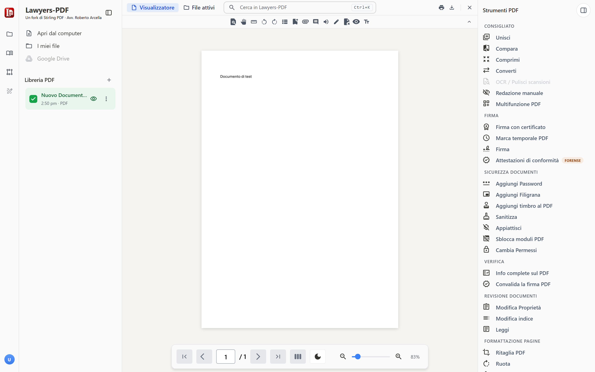

# Lawyers-PDF

**Strumenti PDF per lo studio legale, in locale.** Unire, dividere, comprimere, convertire, oscurare,
riconoscere il testo delle scansioni, firmare, marcare temporalmente — e redigere le **attestazioni di
conformità**, con dieci modelli pronti per il civile, il penale, il tributario e il CAD.

Nessun account, nessuna registrazione, nessun abbonamento. I documenti non lasciano il computer.

<p align="center">
  
</p>

---

## Che cos'è

Lawyers-PDF è un *fork* di [Stirling PDF](https://github.com/Stirling-Tools/Stirling-PDF), compilato
dalla sola parte libera (licenza MIT) e adattato al lavoro forense italiano. Rispetto all'originale
aggiunge:

- **Attestazioni di conformità** — dieci modelli (artt. 196-*octies*, 196-*novies*, 196-*decies*
  disp. att. c.p.c., art. 111-*ter* c.p.p., processo tributario, artt. 22, 23 e 23-*bis* CAD), con
  profilo del difensore, elenco numerato degli atti, unione dei documenti e modelli modificabili.
- **Apertura dei PDF con un doppio clic** — il programma si registra come applicazione per i file
  `.pdf`, con la propria icona; il documento si apre nella finestra già aperta, senza avviare una
  seconda istanza.
- **Finestra applicazione** — l'interfaccia si apre in una finestra senza schede né barra degli
  indirizzi, non in una scheda del browser.
- **Interfaccia in italiano** e nomi coerenti con il lessico forense.

## Che cosa non c'è

La build è compilata con `DISABLE_ADDITIONAL_FEATURES=true`: il modulo proprietario di Stirling PDF
non è incluso. Di conseguenza non esistono — non sono «disattivati» — login e account, archiviazione
remota, automazioni a pagamento, fatturazione a consumo, team e SSO.

## Scarica

Le release contengono:

| File | Che cos'è |
| --- | --- |
| `Lawyers-PDF-<versione>-windows-x64.exe` | Eseguibile autoestraente: doppio clic, si sceglie la cartella, e il programma è pronto. |
| `Lawyers-PDF-<versione>-windows-x64.zip` | Lo stesso contenuto, da estrarre a mano. |
| `Manuale-Lawyers-PDF.pdf` | Il manuale d'uso completo, con le immagini del programma. |

Java **non** va installato: l'ambiente di esecuzione è incorporato nel pacchetto.

Al primo avvio Windows SmartScreen può chiedere conferma, perché l'eseguibile non è firmato con un
certificato commerciale: *Ulteriori informazioni* → *Esegui comunque*.

## Come si usa

Il [manuale](docs/Manuale-Lawyers-PDF.pdf) spiega tutto: installazione, associazione dei PDF,
interfaccia, attestazioni passo passo, firme e marche temporali, rassegna degli strumenti, ricette
per lo studio.

Due punti che conviene conoscere subito:

- **Le firme.** Il programma appone firme digitali con certificato da file (PKCS#12, PEM, JKS) o da
  dispositivo (business key e smart card, tramite archivio certificati di Windows o PKCS#11). La
  firma prodotta è nella forma classica `adbe.pkcs7.detached` (PAdES *basic*), non PAdES-BES: **per i
  depositi telematici si continui a usare il software di firma del proprio prestatore.** Lo strumento
  «Firma» disegna invece un'immagine, che non ha valore di firma elettronica.
- **Le marche temporali.** Sono conformi all'RFC 3161, con impronta SHA-256, e vengono incorporate
  come *document timestamp*. I servizi preconfigurati sono gratuiti ma **non qualificati** ai sensi
  del regolamento eIDAS: non godono della presunzione dell'art. 41 e il loro valore resta rimesso al
  libero apprezzamento del giudice. Quando la data certa è un elemento della fattispecie, serve una
  marca qualificata.

## Riservatezza

Il programma è un server locale in ascolto su `localhost`: i documenti restano sul computer e le
elaborazioni avvengono lì. L'unica operazione che richiede la rete è la marca temporale, e anche in
quel caso viene inviata soltanto l'impronta SHA-256 del documento, non il documento.

Il profilo del difensore (nome, codice fiscale, foro, studio, PEC) è vuoto nella build distribuita:
si compila una volta e resta nella memoria locale del programma, su quel computer.

## Compilare dai sorgenti

Servono JDK 25, Node 22 e [go-task](https://taskfile.dev).

```bash
export DISABLE_ADDITIONAL_FEATURES=true
cd frontend && npx vite build editor --mode core && cd ..
./gradlew bootJar -PbuildWithFrontend=true
```

Il pacchetto Windows si costruisce poi con `jpackage --type app-image`; gli script accessori
(associazione dei PDF, collegamenti, arresto) sono in `packaging/windows/`.

## Licenza, marchi, responsabilità

Distribuito con **licenza MIT**, come l'opera da cui deriva: si veda [`LICENSE`](LICENSE) per il
testo originale e [`LICENZA-Lawyers-PDF.txt`](LICENZA-Lawyers-PDF.txt) per la licenza d'uso di questa
versione in italiano.

«Stirling PDF» è un marchio del suo titolare. **Lawyers-PDF non è un prodotto di Stirling PDF Inc.,
non è da essa approvato né sostenuto**; il riferimento all'origine del codice ha la sola finalità di
attribuzione che la licenza impone.

> Il software è fornito «così com'è», senza garanzia di alcun tipo. La correttezza e la veridicità
> delle attestazioni di conformità, la scelta del modello, la verifica della conformità delle copie e
> l'osservanza delle norme sul deposito telematico restano di **esclusiva responsabilità del
> difensore che sottoscrive**. Il programma è uno strumento di redazione: non esprime pareri, non
> verifica documenti, non sostituisce il controllo professionale.
